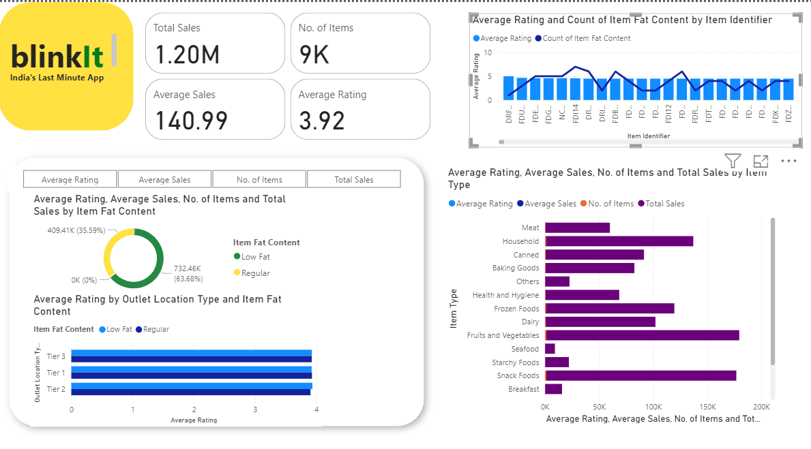

# Blinkit Data Analyst Project

## Overview

Welcome to the **Blinkit Data Analyst Project**! This project leverages Power BI to analyze and visualize key metrics for Blinkit, a leading retail platform. The primary focus of this analysis is to provide insights into:

- **Average Rating**: Understanding the average customer ratings for products.
- **Total Sales**: Evaluating the overall sales performance.
- **Number of Items**: Analyzing the quantity of items sold.
- **Average Sales**: Insights for Avearge Sales.

## Features

- **Interactive Dashboards**: Visualize key metrics with interactive charts and graphs.
- **Data Insights**: Gain insights into customer ratings, sales trends, and inventory performance.
- **Trend Analysis**: Track changes over time to identify patterns and anomalies.

## Project Visualization

Here’s a glimpse of the dashboard:

